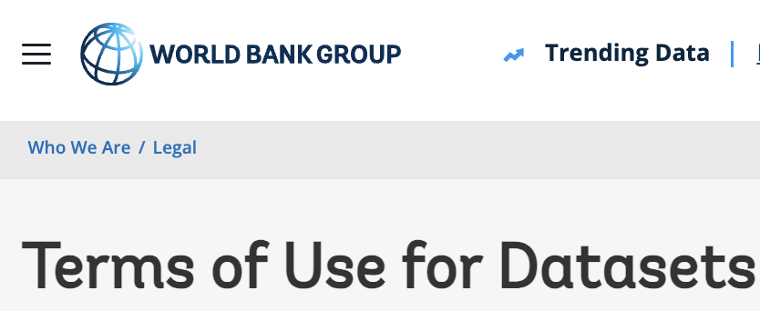
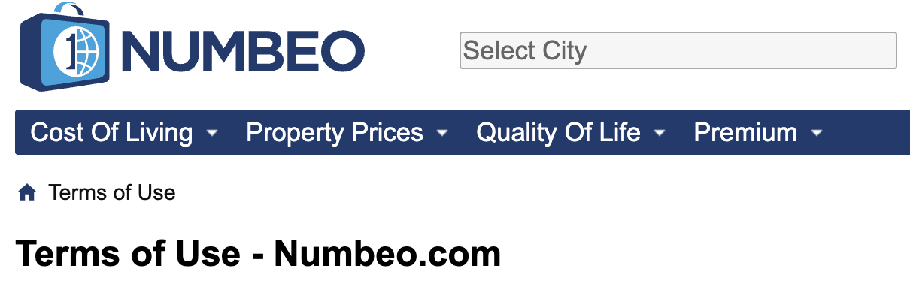
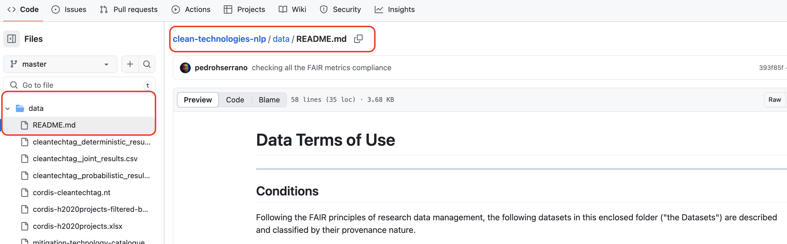
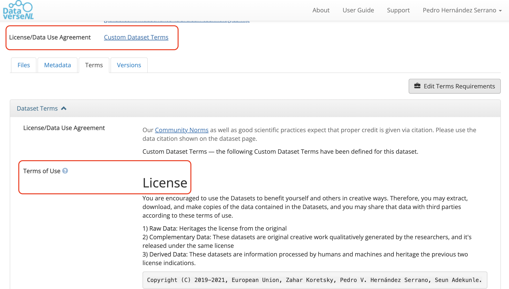

::::::::::::::: questions

- What are data terms of use?
- What should a data terms of use statement contain?
- What format should terms of use use?
- What standard licenses are available for data?

:::::::::::::::::::::::::::::::::

::::::::::::::::::::: objectives

- Understand what data terms of use are and why they matter.
- Identify the minimum components of a basic terms of use statement.
- Recognize when a standard license is sufficient and when a custom agreement is needed.

::::::::::::::::::::::::::

> **FAIR principles used in Data Terms of Use:** 
>
> **Accessible**
> 
> - FM-A2 Metadata Longevity: [doi.org/10.25504/FAIRsharing.A2W4nz](https://doi.org/10.25504/FAIRsharing.A2W4nz)  
>
> **Reusable**
> 
> - FM-R1.1 Accessible Usage License: [doi.org/10.25504/FAIRsharing.fsB7NK](https://doi.org/10.25504/FAIRsharing.fsB7NK)  

## 1 What are data terms of use?

A Data Terms of Use is a textual statement that sets out the rules, conditions, licenses, and legal considerations that govern reuse of a data source.

{alt="Screenshot of part of the Terms of Use for Datasets page on the World Bank Group's website"}

**The World Bank** - [Terms of Use for Datasets](https://www.worldbank.org/en/about/legal/terms-of-use-for-datasets)  
 

{alt="Screenshot of part of the Terms of Use page on NUMBEO.com's website"}

**Numbeo.com** - [Terms of Use](https://www.numbeo.com/common/terms_of_use.jsp)    

These examples show that terms of use usually describe the resource, the conditions under which it may be reused, and any expectations around attribution or restrictions.

## 2 What must a Terms of Use Statement contain?

As a minimum, a data terms of use statement should cover the following elements:

|Section| Description|Example|
|---|---|---|
|**Description**| What the statement refers to and what Digital Objects it covers |*These terms apply to the HAPPY dataset*|
|**License**| Under which conditions reuse is allowed |*The HAPPY dataset is in the Public Domain*|
|**Attribution**| How the data should be cited or acknowledged |*Please cite the HAPPY dataset*|
|**Disclaimer**| Important limitations or caveats |*The last 100 records may contain selection bias*|

Depending on the context, the statement may need additional clauses for multiple databases, sensitive data, embargoes, or obligations coming from a larger project that the dataset was created within (see callout).

::::::::::::::::::::::::::::::::::::: callout

### Terms of use are part of the legal basis for reuse

The terms of use statement is the formal basis on which others may access and reuse a data source. If your work sits inside a larger project or policy framework, check whether terms already exist before drafting a new statement.

An example of a broader policy framework is the FAIRsharing record for the 1958 Birth Cohort policy:  

- FAIRsharing entry: <https://fairsharing.org/FAIRsharing.z09fg9>
- Original policy document: <https://cpb-eu-w2.wpmucdn.com/blogs.bristol.ac.uk/dist/7/314/files/2015/07/POLICY-DOCUMENT-FINAL-Vsn-4.0-DEC-2014.pdf>

::::::::::::::::::::::::::::::::::::::::::::::::
 

## 3 What format should terms of use use?

Terms of use should be stored as plain text in a machine-friendly format such as `.txt`, `.md`, or `.html`. The exact length and level of detail will vary by project, but the statement should be easy for people to read and for systems to preserve.

Keep the statement in an accessible text format. You can draft terms of use in almost any editor, but the final version should be stored in a format that does not depend on proprietary software to read it. Many projects place the statement in a `README`, `LICENSE`, or similar documentation file.

::::::::::::::::::: challenge

### Terms of Use

Visit the City of Philadelphia terms-of-use file: [github.com/CityOfPhiladelphia/terms-of-use/blob/master/LICENSE.md](https://github.com/CityOfPhiladelphia/terms-of-use/blob/master/LICENSE.md)  

Answer the following:

- What kind of resource is it about?   
- In what format is the statement written?    
- On which platform is it published?     

:::::::::::::::: solution

- It is a terms-of-use style statement published for city-maintained digital resources.
- The file format is Markdown (`.md`).
- It is published on GitHub.

::::::::::::::::::
::::::::::::::::::

The statement itself often lives next to the data documentation:

{alt="Folder structure containing a README or license file"}

Some repositories let you define tailored reuse conditions directly on the platform. Dataverse, for example, defaults to a CC0 waiver but also allows custom terms after dataset creation.

{alt="Repository interface showing license and terms options"}

:::::::::::::::: challenge

### Editing Terms of Use

Is it possible to edit the Terms of Use in the Harvard Dataverse?

Check the [Harvard Dataverse](https://dataverse.harvard.edu/) documentation to find the answer.

::::::::::::::::: solution

Yes. After uploading a dataset, you can go to the Terms tab, click on "Edit Terms Requirements" and choose a license from the dropdown or select 'Custom Dataset Terms' to provide your own terms and conditions. 

If you don't do this your data will be given a default license. Different Dataverse installations assign different default licenses. In the case of the Harvard Dataverse that default license is CC0.

:::::::::::::::
:::::::::::::::

Useful reference:

- Sample Data Usage Agreement: <https://dataverse.org/best-practices/sample-dua>

## 4 Are there standard Licenses we can pick from?

Two commonly used licensing families for data are:

- [Creative Commons (CC)](https://creativecommons.org/about/cclicenses/)
- [Open Data Commons (ODC)](https://opendatacommons.org/licenses/index.html)  

Creative Commons licenses are easy to understand and widely recognized, even if they were not designed only for data. Below are the marks they use and what they mean:

| Mark | Meaning |
| --- | --- |
| 0 | All rights are waived under copyright law |
| BY | Creator must be credited |
| SA | Derivatives or redistributions must use the same license |
| NC | Only non-commercial uses are allowed |
| ND | No derivatives are allowed |

Open Data Commons licenses are more explicitly data-oriented and give very detailed explanations of what can and cannot be done with the data.

:::::::::::::::::: challenge

### License Type

Choose a license at [creativecommons.org](https://creativecommons.org/share-your-work/) with the following conditions: 

- Others cannot modify the work
- Commercial reuse is allowed

**Which license fits?**

:::::::::::::::::: solution

Attribution-NoDerivatives 4.0 International, or CC BY-ND 4.0

:::::::::::::::::::
:::::::::::::::::::

:::::::::::::::::: discussion
 
You are collaborating on a study of quality of life in children and plan to collect potentially sensitive information about bullying, social media, and family structure.

What should be considered when drafting terms of use for this study? Should the statement be drafted only by the researchers, or should legal and governance support be involved?

::::::::::::::::::::::::::

:::::::::::::::: keypoints

- A data terms of use statement defines the legal and practical basis for reuse.
- A license is the minimum requirement, but some projects need richer terms or a custom agreement.
- Store terms of use in an accessible text format such as `.md` or `.txt`.
- If a standard license does not fit the project, a tailored terms-of-use statement or usage agreement may be necessary.

::::::::::::::::::::
