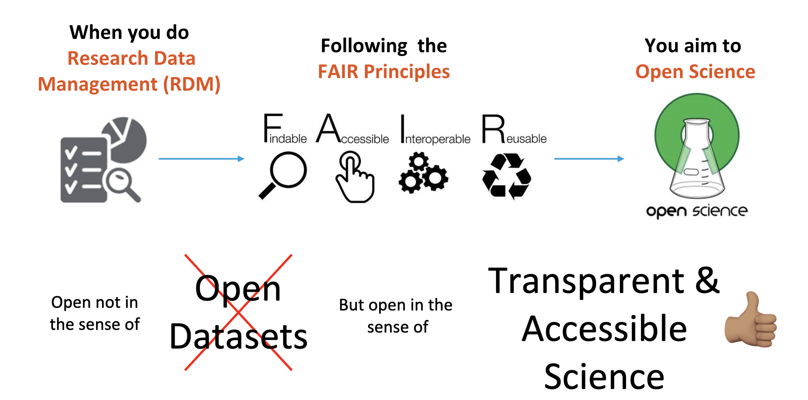

:::::::::::::::::::::: questions

- Does FAIR data mean open data?
- What are Digital Objects and Persistent Identifiers?
- Different types of PIDs

::::::::::::::::::::::

::::::::::::::::::::::::: objectives

- Understand that the FAIR principles are fundamental for Sustainable Science
- Know what human and machine-friendly digital objects are

:::::::::::::::::::::::::

### 1. Does FAIR data mean open data?

No.    
FAIR means human and machine-friendly data sources which aim for transparency in science and future reuse.  

{alt="FAIR and Open Science" style="max-width: 80%; height: auto;"}

## What does it mean to be machine-readable vs human-readable?  
**Human Readable**: “Data in a format that can be conveniently read by a human. Some human-readable formats, such as PDF, are not machine-readable as they are not structured data, i.e., the representation of the data on disk does not represent the actual relationships present in the data.”  
**Machine Readable**: “Data in a data format that can be automatically read and processed by a computer, such as CSV, JSON, XML, etc. Machine-readable data must be structured data. Compare human-readable. Non-digital material (for example, printed or hand-written documents) is not machine-readable by its non-digital nature. But even digital material need not be machine-readable. For example, consider a PDF document containing tables of data. These are definitely digital but are not machine-readable because a computer would struggle to access the tabular information - even though they are very human-readable. The equivalent tables in a format such as a spreadsheet would be machine-readable. As another example, scans (photographs) of text are not machine-readable (but are human-readable!) but the equivalent text in a format such as a simple ASCII text file can be machine-readable and processable.”

{alt="Machine Friendly DO"}

