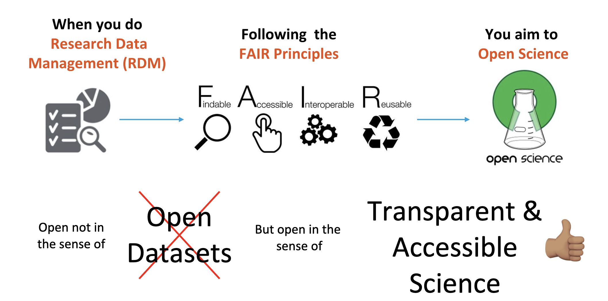
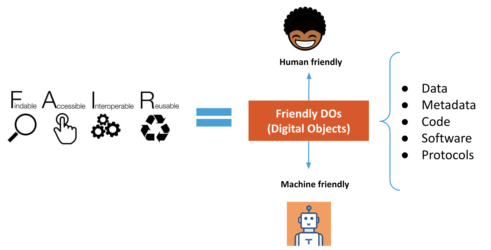

:::::::::::::::::::::: questions

- Does FAIR data mean open data?
- What are Digital Objects and Persistent Identifiers?
- What kinds of persistent identifiers are commonly used?

::::::::::::::::::::::

::::::::::::::::::::::::: objectives

- Understand that the FAIR principles are fundamental for Sustainable Science
- Know what human and machine-friendly digital objects are

:::::::::::::::::::::::::

## 1. Does FAIR data mean open data?

No.    
FAIR means that data and related research objects are designed to be easy for humans and machines to find, understand, access, and reuse. Some FAIR data can also be open, but openness and FAIRness are not the same thing. Sometimes data cannot be shared openly (for example where it is health data relating to individual patients), but it can be made FAIR.

{alt="Diagram showing a mixture of text and icons with the message: When you do Research Data Management (RDM) following the FAIR Principles you aim to Open Science. Open not in the sense of Open Datasets but open in the sense of Transparent and Accessible Science" style="max-width: 80%; height: auto;"}

### What does it mean to be machine-readable vs human-readable?  

**Human Readable**: 

> “Data in a format that can be conveniently read by a human. Some human-readable formats, such as PDF, are not machine-readable as they are not structured data, i.e., the representation of the data on disk does not represent the actual relationships present in the data.”

**Machine Readable**: 

>“Data in a data format that can be automatically read and processed by a computer, such as CSV, JSON, XML, etc. Machine-readable data must be structured data. Compare human-readable. Non-digital material (for example, printed or hand-written documents) is not machine-readable by its non-digital nature. But even digital material need not be machine-readable. For example, consider a PDF document containing tables of data. These are definitely digital but are not machine-readable because a computer would struggle to access the tabular information - even though they are very human-readable. The equivalent tables in a format such as a spreadsheet would be machine-readable. As another example, scans (photographs) of text are not machine-readable (but are human-readable!) but the equivalent text in a format such as a simple ASCII text file can be machine-readable and processable.”

{alt="Diagram showing that FAIR equals Friendly DOs (Digital Objects) such as Data, Metadata, Code, Software and Protocols and is Human and Machine Friendly"}

### Machine friendly = Machine-readable + Machine-actionable + Machine-interoperable
During this courcebook, we will be using "Machine-readable" and "Machine friendly" interchangeably. We like the term "friendly" since it can also include "machine-actionability" and "machine-interoperability."

## 2. What are Digital Objects and Persistent Identifiers?

A **Digital Object** is a bit sequence located in a digital memory or storage that has informational value on its own. For example:  

- A scientific publication
- A dataset
- A rich metadata file
- A README file describing access and reuse conditions

A **Persistent Identifier**, or PID, is a durable reference to a digital or physical resource. PIDs are backed by technical infrastructure and governance arrangements that help them continue resolving even when the resource itself changes location.

Common uses of PIDs include those identifying:

- articles, datasets, and software
- researchers
- organizations and funders
- projects and instruments
- physical samples and media objects

DOI is one well-known PID type and is commonly used for datasets and publications. ORCID is another example, focused on researcher identity.

For a short explainer of the importance of PIDs, see the [FREYA project video](https://en.wikipedia.org/wiki/File:FREYA-The-power-of-PIDs-V05-1.webm)

::::::::::::::::: callout

### To learn more about FAIR Digital Objects

- **FAIR Digital Objects: Which Services Are Required?** [(Schwardmann, Ulrich 2020)](https://datascience.codata.org/articles/10.5334/dsj-2020-015/)
- **FAIR Digital Object Framework Documentation** [(Bonino da Silva Santos, Luiz Olavo 2020-22)](https://fairdigitalobjectframework.org/))

::::::::::::::::::

:::::::::::::::: challenge

### arXiv

arXiv is a preprint repository for physics, math, computer science, and related disciplines. It allows researchers to share and access their work before it is formally published. 

Visit the arXiv new papers page for [Machine Learning](https://arxiv.org/list/cs.LG/recent). 
Pick a paper, open its PDF, and search for `http` or `doi`.

What kinds of links do the authors use for data or software references, and why is a DOI usually more robust than a personal website or repository link alone?
 
:::::::::::::: solution

Authors often link to GitHub repositories, project pages, or other web pages for software and data. Those locations may move or disappear over time. A DOI is more robust because it resolves through persistent infrastructure and points to current metadata about the object even if the storage location changes.

::::::::::::::::::::::::::
:::::::::::::::::::::::::

:::::::::::::::::::::::::::: discussion

### How does your discipline share data?

How does your discipline usually share data? Is there a data journal, domain repository, or another community-specific mechanism for making research outputs findable and reusable? 

For example, the American Astronomical Society (AAS), via the publisher IOP Physics, offers a [supplement series](https://iopscience.iop.org/journal/0067-0049/page/article-data) as a way for astronomers to publish data. 

::::::::::::::::::::::::::::

:::::::::::::::::::::::: keypoints

- FAIR means human and machine-friendly data sources which aim for transparency in science and future reuse.
- DOI (Digital Object Identifier) is a type of PID (Persistent Identifier)

::::::::::::::::::::::::

